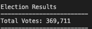
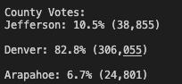
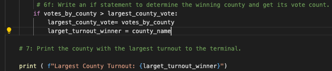
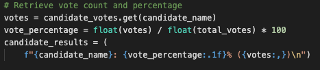
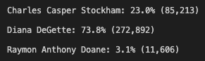
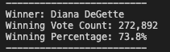

# Election-Analysis
Election audit for Colarado Board of Election of US Congressional District elections

## Overview of Election Audit: 

The purpose of this audit analysis is to certify the results of a US Congresssional race. The Board of Elections would like to test pythons ability to streamline and automate the election auditing system for Colarado's state and local elections.

Once the audit was completed, a Vote Count Report was created with the following information. 
  * Total number of votes cast
  * Total number and percentage of total votes for each candidate
  *  The winning candidtate based on popular vote
  *  The number and percentage of total votes per county
  *  The county with the largest turnout

## Election-Audit Results: 

* In total, there were 369,711 votes casted in this election

    

* The number of votes and the percentage of total votes for each county in the precinct are as follows: 

    

* Using an if statement, I was able to determine that Denver county had the most votes counted.

    

    

* To get the the number of votes and the percentage of the total votes each candidate received the following code was used: 

    

    * This code yielded these results: 
    
          

* The winner of the election is Diana DeGette:

    

## Election-Audit Summary: 

This script would be a valuable tool for all elections. The Board of Elections would be able to use the script by importing similarly formatted csv data for other elections. The script would quickly generate this infomation for various elections. 

The script may have to be modified based on the formatting of imported data, if different from the elections_results.csv used in this analysis.

The script would also have to be updated for all "txt_file.write" code to the new file path were results will be written. 

Lastly, the script would have to be modified to pull data that was not requested as a part of this analysis.
